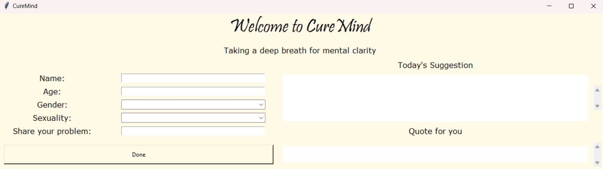

# CureMind

Welcome to CureMind - Taking a deep breath for mental clarity.

## Overview

CureMind is a simple desktop application developed in Python using the Tkinter library. It aims to provide mental health support by generating personalized suggestions and inspirational quotes based on the user's input.



## Features

- **Personalized Suggestions:** Users can input their name, age, gender, sexuality, and share their problems to receive personalized suggestions.
- **Inspirational Quotes:** Additionally, users can request an inspiring quote tailored to their situation.

## Prerequisites

Make sure you have the following installed before running the application:
- Python 3
- Required Python packages (tkinter, markdown2, tkhtmlview, google.generativeai)
  ```bash
  pip install <package_name>
- Gemini Pro API key from the [Gemini AI Studio](https://makersuite.google.com/app/apikey)

## Getting Started

1. Create a Virtual Environment
   ```bash
   $ pip install virtualenv
   $ virtualenv CureMind
   
2. Activate environment
   ```bash
   $ cd CureMind
   $ Scripts\activate 
   
3. Install the Python SDK:

   ```bash
   $ pip install -q -U google-generativeai

4. Import packages
   ```python
   import google.generativeai as genai

5. Setup your API key
   ```python
   GOOGLE_API_KEY='GOOGLE_API_KEY'

   genai.configure(api_key=GOOGLE_API_KEY)
   
## Usage
- Fill in your details (Name, Age, Gender, Sexuality, and Problem) in the provided fields.
- Click the "Done" button to generate personalized suggestions and an inspirational quote.
- Explore the suggestions and quote provided.

## Contributing
If you'd like to contribute to CureMind, please fork the repository and create a pull request with your changes. We welcome contributions!

<hr>

Feel free to reach out if you have any questions or feedback!
